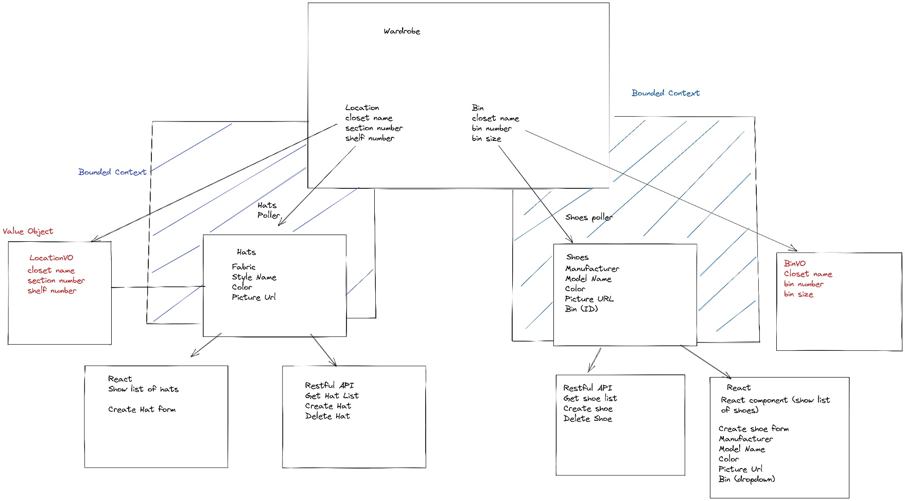
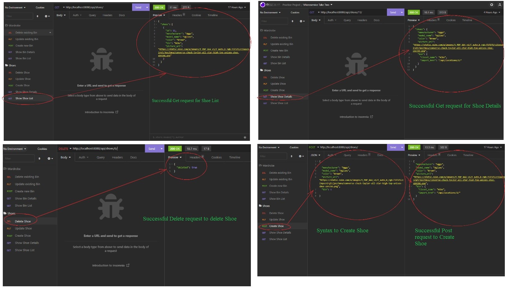

# Wardrobify

Team:

Brandon Matran - Shoes
Patrick Mordaunt - Hats

## How to run the project
- Start by forking the project from the following: https://gitlab.com/b_matran/microservice-two-shot

- Copy the Clone with HTTPS link.

- Open up your command terminal and cd into your project directory. Ex: CD E:\Projects

- In your command terminal type:

            git clone <paste Clone with HTTPS link>

- In your command terminal type:

            docker volume create pgdata

- In your command terminal type (this is to create images):

            docker-compose build

- Then type (to create containers):

            docker-compose up

* All containers should be running and you should be able to see the app from http://localhost:3000

## Trouble Shooting Docker (If one or more containers are not running)

In your command terminal type:

        docker container prune -f

        docker volume rm pgdata

        docker volume create pgdata

        docker-compose up

## Ports

Port 3000 - Connect to React APP

Port 15432 - Postgres DB

Port 8080 - Shoes API

Port 8090 - Hats API

Port 8100 - Wardrobe API

## Design

## Wardrobe API

|   Method      |       URL                               |    What it does             |
| ------------- |:---------------------------------------:| ---------------------------:|
| GET           | http://localhost:8100/api/bins/         | GET request List of Bins    |
| GET           | http://localhost:8100/api/bins/<int:pk>/| GET request Bin Details     |
| POST          | http://localhost:8100/api/bins/         | POST request to Create Bin  |
| PUT           | http://localhost:8100/api/bins/<int:pk>/| PUT request to Update Bin   |
| DELETE        | http://localhost:8100/api/bins/<int:pk>/| DELETE request to Delete Bin|

## Shoes microservice

Models

Shoes ()
-Manufacturer
-Model Name
-Color
-Picture URL
-Bin

BinVO (Value Object to Bin) This is needed so that we can make changes to our shoe models without having to access the Bin Entity in Wardrobe
-Closet Name
-Bin Number
-Bin Size

## CRUD

|   Method      |       URL                                |    What it does              |
| ------------- |:---------------------------------------: | ----------------------------:|
| GET           | http://localhost:8100/api/shoes/         | GET request List of Shoes    |
| GET           | http://localhost:8100/api/shoes/<int:pk>/| GET request Shoes Details    |
| POST          | http://localhost:8100/api/shoes/         | POST request to Create Shoe  |
| PUT           | http://localhost:8100/api/shoes/<int:pk>/| PUT request to Update Shoe   |
| DELETE        | http://localhost:8100/api/shoes/<int:pk>/| DELETE request to Delete Shoe|

# Insomnia Shoes Requests

## Hats microservice

## Wardrobe API

|   Method      |             URL                              |    What it does                                |
| ------------- |:--------------------------------------------:| ----------------------------------------------:|
| GET           | http://localhost:8100/api/locations          | GET request List of Closet Locations           |
| GET           | http://localhost:8100/api/locations<int:pk>/ | GET request Closet Location Details            |
| POST          | http://localhost:8100/api/locations/         | POST request to Create New Closet Location     |
| PUT           | http://localhost:8100/api/locations<int:pk>/ | PUT request to Update Existing Closet Location |
| DELETE        | http://localhost:8100/api/locations<int:pk>/ | DELETE request to Delete Closet Location       |

## Models

Hats ()
- Fabric
- Stlye Name
- Color
- Picture Url
- Location

LocationVO (Value Object to Location) Required so that model changes can be made without having access to the Location Entity in wardrobe.
- Closet Name
- Import Href
- Section Number
- Shelf Number

## CRUD

|   Method      |             URL                              |    What it does                    |
| ------------- |:--------------------------------------------:| ----------------------------------:|
| GET           | http://localhost:8090/api/hats/              | GET request List of Hats           |
| GET           | http://localhost:8090/api/hats/<int:pk>/     | GET request Hat Details            |
| POST          | http://localhost:8090/api/hats//             | POST request to Create New Hat     |
| PUT           | http://localhost:8090/api/hats/<int:pk>/     | PUT request to Update Existing Hat |
| DELETE        | http://localhost:8090/api/hats/<int:pk>/     | DELETE request to Delete Hat       |

## Insomnia Hats Requests

